<div align="center">

# 🎮 LevelUp Chores

**Turn the family chore list into a game worth showing up for.**

A self-hosted, gamified chore and allowance tracker for households — daily quests, a hidden bonus chore, a bonus wheel, streak rewards, and a loot shop kids actually cash out at.

[](https://php.net)
[](https://laravel.com)
[](https://livewire.laravel.com)
[](https://tailwindcss.com)
[](#-testing)
[](#-install-it-like-an-app)
[](LICENSE)

</div>

---

## Why this exists

Chore charts fail because they're a list of obligations with a delayed, abstract payoff. This one borrows from games instead: a surprise assignment each morning, a secret chore worth a jackpot, a wheel that multiplies your take, streaks that compound, and a shop where points become real things.

Everything is scoped to one household. There's no public sign-up, no email/password, and no kid-vs-kid leaderboard — just a profile picker, a 4-digit PIN, and a shared family goal everyone's points feed into.

---

## Screenshots that are more than likely out of date, but it looked like this at one point


## 🔁 The daily loop

```mermaid
flowchart LR
    A["🎁 Open the chest<br/><i>reveals today's quest</i>"] --> B["✅ Clear the quest"]
    B --> C["🔓 Side quests unlock<br/><i>instantly, no waiting</i>"]
    C --> D["🎯 Claim chores<br/><i>one is secretly the Mystery</i>"]
    D --> E["🧑‍⚖️ Parent approves"]
    E --> F["💰 Points · XP · Streak"]
    F --> G["🛒 Cash out in the Loot Shop"]

    style A fill:#2a1f4d,stroke:#8b5cf6,color:#fff
    style D fill:#4d3a1f,stroke:#f59e0b,color:#fff
    style E fill:#1f3a4d,stroke:#06b6d4,color:#fff
    style F fill:#1f4d2a,stroke:#22c55e,color:#fff
```



The board **unlocks on the claim, not the approval** — deliberately. A kid should never be blocked waiting on a parent to check their phone. Points and streaks, however, only land once a parent signs off.

---

## ✨ What's in it

### For kids

| | Feature | How it works |
|---|---|---|
| 🎁 | **Daily Quest** | One randomly assigned chore per kid per day, hidden inside a chest. Opening it is the reveal moment. Optionally gates the rest of the board until cleared. |
| 🕵️ | **Mystery Chore** | Each day one chore is secretly worth **+500 points**. Nobody knows which. The first kid in the household to finish it wins — then everyone sees who got it. |
| 🎡 | **Bonus Wheel** | One spin a day. Lands on a chore and multiplies it **2×**, or **3×** on a 35% roll. |
| 🔥 | **Streak Chest** | Consecutive days of approved quests build a streak. Milestones pay real money and unlock a chest with a reveal animation. |
| 🛒 | **Loot Shop** | Spend points on rewards the parent defines — screen time, Robux, dessert pick, a family outing. |
| 🏅 | **Badges** | 13 achievements on their own tab, each with what unlocks it and the XP it pays. 5 are secret — name and description stay hidden until earned. |
| 🎟️ | **Bonus Shop** | Levelling up and earning badges mint **tickets**. Spend them on wheel respins, quest rerolls, streak repairs, and hints about the Mystery Chore. Spending never costs XP — your level is permanent. |
| 🎯 | **Family Goal** | A shared thermometer every kid's points feed. No rankings, no sibling competition — by design. |

### For parents

| | Tab | What you do there |
|---|---|---|
| ✅ | **Approvals** | One queue for chore completions *and* reward redemptions. Approve or send back. |
| 📋 | **Quests** | Search, add and edit chores — points, cadence, minimum age, quest eligibility, and the mystery hint. |
| 🎁 | **Loot Shop** | Manage the reward catalog and pricing, plus perk pricing and which perks are switched on. |
| 👨‍👩‍👧 | **Kids & Points** | Balances, tickets, levels, manual adjustments, cash-in/payout, PIN resets, per-kid spin reset, quest swap, and today's Mystery Chore. |
| 📜 | **Activity** | The full append-only points ledger, plus a separate card for ticket activity. |

Parents can opt into **web push notifications**, so a claim buzzes their phone instead of requiring them to check the app.

---

## 🧠 The systems, in detail

<details>
<summary><b>Mystery Chore — fair by construction</b></summary>

<br>

Picked automatically each day, with no parent setup. The candidate pool is filtered so the game stays fair:

- **Any-age chores only** — an age-gated chore would lock the youngest kid out before the race began.
- **No unlimited-cadence chores** — those are freely repeatable by everyone, which is incompatible with "first one to find it wins."
- **Nothing already claimed today** — picking a chore someone already finished would make the reveal meaningless.
- **No spent one-time chores** — a one-time chore that's already been taken isn't on anyone's board to find.

Chores with a parent-written hint win the draw outright, so the Bonus Shop's hint perk always has something to sell — which means hints want writing broadly, or the mystery becomes guessable.

The pick is persisted per household per day, so it stays the same chore for everyone all day no matter how many times the page is loaded. Claiming it locks it household-wide; a parent rejecting the claim reopens it. A parent can also swap the pick from Kids & Points — but not once someone has found it.

</details>

<details>
<summary><b>Streaks — earned on approval, not on the honour system</b></summary>

<br>

A day counts toward the streak only if that day's quest was **approved**. The streak is *recomputed* by walking back over approved days rather than incremented — so a parent clearing several days of backlog can approve them in any order and still land on the right number.

| Streak | Bonus |
|:---:|:---:|
| 3 days | $1 |
| 5 days | $3 |
| 7 days | $5 |
| 14 days | $15 |
| 30 days | $40 |

Bonuses hit the ledger the moment they're earned, but the *reveal* waits for the kid to open the streak chest. Milestones only pay for days newly crossed, so a recompute can never double-credit.

</details>

<details>
<summary><b>Bonus Wheel — random result, stable display</b></summary>

<br>

One spin per kid per day. The result is genuinely random. The *wheel itself* is not: above 10 eligible chores, the displayed subset is chosen by a deterministic per-kid, per-day hash, and always force-includes whatever chore was actually landed on. Without that, the wheel would silently show a different set of options on every page load — including forgetting the chore it just landed on.

</details>

<details>
<summary><b>XP, levels and tickets — progress you can't spend</b></summary>

<br>

Three currencies, doing three different jobs:

| | Earned by | Spent on |
|---|---|---|
| **Points** | Approved chores | Loot Shop — real-world rewards a parent hands over |
| **XP** | Chores (+25) and badges (50–400) | **Nothing.** It only ever goes up, and it drives your level |
| **Tickets** | 1 per level crossed, 1 per badge | Bonus Shop — perks that bend the game's own rules |

The point of the split: a kid should never have to choose between keeping their progress and buying something. XP *mints* tickets, it isn't *converted* into them, so a level once reached is permanent no matter how much gets spent.

Both minting paths are guarded by high-water marks — `tickets_granted_through_level` and `streak_milestone_paid_through`. XP can fall (`quest:reset-today` claws back 25 per undone approval) and a streak can lapse and be repaired, so without them the same threshold could pay out twice.

Perks apply **instantly** with no parent approval, which is the line between the two shops: loot is a promise someone has to keep, a perk is a rule bending itself.

</details>

<details>
<summary><b>Points ledger — one source of truth</b></summary>

<br>

`profiles.points` is a **cache**. The `ledger_entries` table is the truth. Every balance change — earn, spend, cash-in, cash-out, manual adjustment — goes through a single service that writes the entry and updates the cached balance inside one transaction, so the two can never drift.

</details>

<details>
<summary><b>Household clock — the day ends at 4am</b></summary>

<br>

A chore finished at 1am should count for the day that's ending, not the one starting. Every cooldown, streak, quest assignment, and daily reset resolves through a household clock with a configurable day-boundary hour (default `4`), never raw `now()`.

</details>

---

## 🛠 Tech stack

| Layer | Choice |
|---|---|
| Backend | **Laravel 13**, PHP 8.4.1+ |
| Frontend | **Livewire 4** + **Volt** single-file components, Alpine.js |
| Styling | **Tailwind CSS v4** (CSS-first `@theme`), self-hosted fonts |
| Database | MySQL / MariaDB (in-memory SQLite for tests) |
| Testing | PHPUnit 12 — lots of feature tests |
| Push | Web Push (VAPID) for parent alerts |
| Deploy | Built for [Laravel Cloud](https://cloud.laravel.com) |

No SPA framework, no heavy client build. The wheel is a `conic-gradient`, the avatars are coloured tiles, the badges are single glyphs — there isn't a raster image in the UI.

---

## 🚀 Getting started

```bash
git clone <your-repo-url> levelup-chores
cd levelup-chores
composer install
npm install
```

```bash
cp .env.example .env
php artisan key:generate
```

Point the `DB_*` values at your database, then:

```bash
php artisan migrate --seed
```

```bash
npm run build
php artisan serve
```

Open <http://localhost:8000> and pick a profile.

### Demo profiles

The seeder creates a placeholder household. **Change these PINs immediately** from *Kids & Points* — anything shipped in a seeder is public by definition.

| Profile | Age | PIN |
|---|:---:|:---:|
| Nova | 12 | `1111` |
| Scout | 9 | `2222` |
| Ziggy | 6 | `3333` |
| Parent | — | `4444` |

---

## ⚙️ Configuration

Name the app whatever your family calls it — the title flows from `APP_NAME` into the login wordmark, the parent console header, the browser tab, and the installed PWA:

```dotenv
APP_NAME="LevelUp Chores"
```

Per-household settings live in the `households` row rather than in config:

| Setting | Default | Meaning |
|---|:---:|---|
| `timezone` | `America/Chicago` | Household-local time |
| `day_boundary_hour` | `4` | Hour the household "day" rolls over |
| `points_per_dollar` | `100` | Conversion rate for cash-out |
| `require_quest_first` | `true` | Gate side quests behind the daily quest |
| `spin_enabled` | `true` | Bonus wheel on/off |
| `goal_name` / `goal_target` | — | The shared family goal |

### Push notifications (optional)

Generate a VAPID pair **per environment** and set `VAPID_SUBJECT`, `VAPID_PUBLIC_KEY`, and `VAPID_PRIVATE_KEY`:

```bash
php artisan webpush:vapid
```

Approval alerts are best-effort — if push fails, it's logged and the kid's chore claim still succeeds.

---

## 📱 Install it like an app

The app ships a PWA manifest and service worker, so it installs to a home screen or desktop and runs without browser chrome. On Android use *Add to Home Screen*; on Windows, Edge's *Install this site as an app*. The manifest is served dynamically, so the installed name follows `APP_NAME`.

---

## 🔐 Security

This is designed to be internet-facing, with kids' balances on the line:

- **PINs are hashed**, never stored in plaintext.
- **Lockout on brute force** — 5 failed attempts locks the profile for 15 minutes, doubling on repeat lockouts up to 4 hours, backed by the database rather than a resettable rate limiter alone.
- **Route middleware *and* in-component role checks** — a kid session can't reach `/parent/*` even if a route guard were misconfigured.
- **Session ID regeneration** on login; `secure` / `httponly` / `samesite` cookies.
- **No public registration** — the route simply doesn't exist.
- `noindex, nofollow` on every page.

---

## 🧪 Testing

```bash
php artisan test
```

Lots of feature tests covering PIN lockout and role isolation, quest gating, cooldown maths across the day boundary, mystery-chore fairness rules, streak recomputation and milestone payouts, the XP/ticket economy and its double-payout guards, perk purchase and refusal paths, redemption deduct-then-fulfil, profile management, and ledger integrity. Tests run against in-memory SQLite and never touch a real database.

---

## 🧰 Artisan commands

### Managing kids

```bash
php artisan kid:save Nova --age=12
```

Creates a kid's profile, or updates an existing one. **First name is the key** — matched case-insensitively, so `nova` finds `Nova`.

Birthdays aren't stored anywhere, deliberately: the app keeps as little personal data as possible, and a chore board only ever needs to know whether someone is old enough for a given chore. The trade-off is that ages don't advance on their own, so once a year:

```bash
php artisan kid:save Nova --age=13
```

Any option you leave off is left untouched, so that command changes the age and nothing else.

| Option | Default | Notes |
|---|:---:|---|
| `--age=` | — | Whole number, 1–25. Required when creating. |
| `--color=` | first unused | `lime`, `cyan`, `gold`, `magenta`, `coral`, `violet` |
| `--pin=` | `1111` when creating | Exactly 4 digits. Omit when updating to keep the current one. |

New profiles start on PIN **`1111`** — change it from **Kids & Points** in the parent console once they've logged in.

### Household settings

```bash
php artisan household:set
```

With no options it just prints the current settings, including the one people actually come looking for — what time the day rolls over, and which day chores are counting toward right now:

```
| Timezone              | America/New_York |
| Day resets at         | 04:00            |
| Points per dollar     | 100              |
| Quest gates the board | yes              |
| Bonus wheel           | enabled          |

It is Thu 30 Jul 2026, 21:50 EDT in this household, and chores counts toward Jul 30, 2026.
```

Pass any of these to change it:

| Option | Default | Notes |
|---|:---:|---|
| `--timezone=` | `America/Chicago` | Any IANA name, e.g. `America/New_York` |
| `--day-boundary-hour=` | `4` | 0–23, in household-local time |
| `--points-per-dollar=` | `100` | Cash-out conversion rate |
| `--require-quest-first=` | `true` | Gate side quests behind the daily quest |
| `--spin-enabled=` | `true` | Turn the bonus wheel on or off |
| `--name=` | — | Display name for the household |

```bash
php artisan household:set --timezone=America/New_York --day-boundary-hour=6
```

The reset time is evaluated in the household's own timezone, so **set the timezone first** — a boundary of `4` means 4am wherever the household says it is, which is 5am Eastern if the timezone is still the seeded Chicago default. The timezone also decides whether the Early Bird and Night Owl badges fire at the right hour.

Moving the boundary **earlier** is safe. Moving it **later** starts today later, pushing the hours in between into yesterday — so a chore already done this morning can come off cooldown and be claimed a second time. The command warns when you do this.

### Resetting a day for testing

| Command | Purpose |
|---|---|
| `php artisan quest:reset-today` | Undo today's quest/spin/chore/loot activity. Leaves accounts, chores, PINs, and prior days untouched. |
| `php artisan wheel:reset-spin` | Clear today's spin so a kid can spin again. |

Both accept `--kid=Name` to scope to one profile and `--dry-run` to preview without writing.

---

## 🤖 Working on this with an AI agent

The repo ships [Claude Code](https://claude.com/claude-code) skills under `.claude/skills/`, documenting the non-obvious mechanics of each subsystem — mystery-chore candidacy rules, wheel determinism, streak recomputation, ledger invariants, badge evaluation — alongside the official Laravel/Livewire/Volt/Tailwind skills from [Laravel Boost](https://laravel.com/docs/boost). An agent picks up the domain rules automatically instead of rediscovering them.

---

## 📄 License

[MIT](LICENSE) — take it, fork it, run it for your own family, change whatever you like, even use it commercially. The only ask is that the copyright notice rides along with copies of the source.

It comes with no warranty. If your kid games the streak system, that's between the two of you.

---

<div align="center">
<sub>Built for one family's kitchen wall. Fork it for yours.</sub>
</div>
