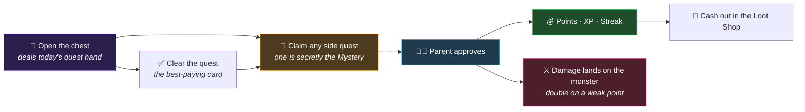

<div align="center">

# 🎮 LevelUp Chores

**Turn the family chore list into a game worth showing up for.**

A self-hosted, gamified chore and allowance tracker for households — a chore board worth browsing, a hidden bonus chore, a bonus wheel, streak rewards, and a loot shop kids actually cash out at.

[](https://php.net)
[](https://laravel.com)
[](https://livewire.laravel.com)
[](https://tailwindcss.com)
[](#-testing)
[](#-install-it-like-an-app)
[](LICENSE)

</div>

---

## Why this exists

Chore charts fail because they're a list of obligations with a delayed, abstract payoff. This one borrows from games instead: a surprise assignment each morning, a secret chore worth a jackpot, a wheel that multiplies your take, streaks that compound, and a shop where points become real things.

Everything is scoped to one household. There's no public sign-up, no email/password, and no kid-vs-kid leaderboard — just a profile picker, a 4-digit PIN, and one shared family goal, drawn as a monster the kids gang up on.

---

## Screenshots that are more than likely out of date, but it looked like this at one point


## 🔁 The daily loop



**There is no "main quest" any more, and nothing about the streak waits on one.** Every chore is claimable from the moment a kid opens the app, and any one of them approved keeps the run alive. The daily quest — a chest, a hand of three cards, one chore that mattered more than the others — was removed: it hid part of the board behind itself, and everything it paid for is paid by the board. What survived it is the **Quest Charm**, which now lights up five random chores at +50% for the kid who cast it.

The board also **moves on the claim, not the approval** — a chore locks for the whole household the second someone taps it, so nobody is blocked waiting on a parent to check their phone. Points, streaks and monster damage, however, only land once a parent signs off.

---

## ✨ What's in it

### For kids

| | Feature | How it works |
|---|---|---|
| ✧ | **Quest Charm** | A ticket buys one. Cast it over the board and **five random chores** pay you half again for the rest of the day — for you only, and you don't get to pick which five. |
| 🕵️ | **Mystery Chore** | Each day one chore is secretly worth **+500 points**. Nobody knows which. The first kid in the household to finish it wins — then everyone sees who got it. |
| 🙋 | **Help Wanted** | A parent flags the one job that actually needs doing. It jumps to the top of the board in its own colour, and whoever finishes it earns a **bonus ticket**. The flag clears itself overnight. |
| 🎡 | **Bonus Wheel** | One spin a day. Lands on a chore and multiplies it **2×**, or **3×** on a 35% roll. |
| 🔥 | **Streak Chest** | Consecutive days with **any** approved chore build a streak. Milestones pay real money and unlock a chest with a reveal animation. |
| 🛒 | **Loot Shop** | Spend points on rewards the parent defines — screen time, Robux, dessert pick, a family outing. |
| 🏅 | **Badges** | 13 achievements on their own tab, each with what unlocks it and the XP it pays. 5 are secret — name and description stay hidden until earned. |
| 🎟️ | **Bonus Shop** | Levelling up, earning badges and beating monsters mint **tickets**. Spend them on wheel respins, quest charms, streak repairs, Mystery Chore hints, OP spins, or the right to name a monster. Spending never costs XP — your level is permanent. |
| 👹 | **The Arena** | The family goal, standing as a monster. Every chore you finish is damage; beat it and the household gets what it was guarding. |
| 🐾 | **Pets** | Bought with tickets or hatched from a surprise egg, a pet runs around your pages and **grows up with your chores**. Every pet helps in the arcade with its **style**; rarer pets also have a **knack** — a trick like sniffing out the Mystery Chore or batting the Bonus Wheel one chore over (kids see it called a **perk**). Feed it a **Power Treat** for more. The Pets page is the pet's own room — its bed and toy drawn in, a Feed button, its age along the floor — with what it does underneath and the shop beside it on a big screen. |
| 🕹️ | **Arcade** | Little games with a weekly board per game. Every run pays **arcade tokens**, capped each day — and every chore you claim raises the cap. Tokens buy pet gear and candy at the prize counter, or swap for tickets. |

### For parents

| | Tab | What you do there |
|---|---|---|
| ✅ | **Approvals** | One queue for chore completions *and* reward redemptions. Approve or send back. |
| 📋 | **Quests** | Search, add and edit chores — points, cadence, minimum age, quest eligibility, and the mystery hint. Plus the two ways to say something is urgent: a deadline to beat, and the Help Wanted flag. |
| 🎁 | **Loot Shop** | Manage the reward catalog and pricing, plus perk pricing and which perks are switched on. |
| 👹 | **Monsters** | Name what the monster is guarding, price it, set its health, swap its face or its weak chore, and nudge the bar by hand. Plus the trophy shelf of everything the family has put down. |
| 🐾 | **Pets** | Make pets from one generated picture (the prompt is on the page), try each age out on your own screen, set each pet's rarity, style and knack, give old pets new art — and see every kid's pet, how grown it is and what its knack has left. |
| 👨‍👩‍👧 | **Kids & Points** | Balances, tickets, levels, manual adjustments, cash-in/payout, PIN resets, per-kid spin reset, quest swap, and today's Mystery Chore. |
| 📜 | **Activity** | The full append-only points ledger, plus a separate card for ticket activity. |

Parents can opt into **web push notifications**, so a claim buzzes their phone instead of requiring them to check the app.

---

## 🧠 The systems, in detail

<details>
<summary><b>The Arena — the family goal, drawn as a monster</b></summary>

<br>

The family goal used to be a thermometer. It's a monster now: a parent names what beating it buys and how many points of work that's worth, and every approved chore is damage on the bar.

Damage is a *shadow* of the same points, not a spend — a kid's own balance is untouched by it, so the arena never competes with the Loot Shop for the work they did.

> **This was three monsters for a while.** Level 1 / 2 / 3 stood at once, each guarding a reward at its own scale, and every finished chore stopped to ask the kid which of them it hit. The choice was real and the kids asked for it, but it cost a tap on every single claim and a decision nobody wanted to make twice a day. One bar, and the work lands where it obviously should.

**The one number that keeps it honest:** the Monsters tab shows `$ per 100 pts` live, so each new monster can be priced against the last rather than by feel.

A few mechanics on top:

- **Weak points.** The monster flinches at one chore, drawn weekly, for double damage. Parents can swap a silly draw; the swap covers that week only and next week rolls on as normal. Resolved at *submit*, so swapping it can't halve a hit a kid already earned.
- **Overkill stops at the kill.** The last blow usually overpays and the excess simply stops there. It used to roll up onto the tier above — the one thing genuinely lost by having a single bar.
- **Catch-up replay.** Chores get approved all day on a screen no kid is looking at, so the arena replays every stage of damage missed since a kid last looked.
- **Health is never stored.** A monster's damage is summed from its hits, which is the same table its leaderboard is grouped from, so the bar and the names under it can't tell different stories.
- **Beating one pays out.** Everyone in the house gets a ticket, the finisher gets two more, and the biggest damage dealer gets two more again — so one kid can take five.

</details>

<details>
<summary><b>Mystery Chore — fair by construction</b></summary>

<br>

Picked automatically each day, with no parent setup. The candidate pool is filtered so the game stays fair:

- **Any-age chores only** — an age-gated chore would lock the youngest kid out before the race began.
- **No unlimited-cadence chores** — those are freely repeatable by everyone, which is incompatible with "first one to find it wins."
- **Nothing already claimed today** — picking a chore someone already finished would make the reveal meaningless.
- **No spent one-time chores** — a one-time chore that's already been taken isn't on anyone's board to find.

Chores with a parent-written hint win the draw outright, so the Bonus Shop's hint perk always has something to sell — which means hints want writing broadly, or the mystery becomes guessable.

The pick is persisted per household per day, so it stays the same chore for everyone all day no matter how many times the page is loaded. Claiming it locks it household-wide; a parent rejecting the claim reopens it. A parent can also swap the pick from Kids & Points — but not once someone has found it.

</details>

<details>
<summary><b>Help Wanted — pointing at one job, without printing money</b></summary>

<br>

Everything else on the board says "here is what you *could* do". This is the one control that says **"here is what we actually need"** — the thing you want to be able to say standing in a messy kitchen at 6pm.

Flag a chore from the Quests tab and it goes to the top of every kid's board wearing its own colour and a badge naming the prize. Whoever finishes it earns **one bonus ticket**.

**Why a ticket and not extra points.** Points are backed by `points_per_dollar` — real money — so "anything I flag pays more" would be a standing pay rise, and a parent who feels that stops using the flag. Tickets cost the household nothing and still buy everything in the Bonus Shop. They're also fairer here: cooldowns are household-wide, so a points bonus on a flagged chore is a race exactly one kid can ever win.

Four rules keep it honest:

- **The flag clears itself overnight.** Nothing to tidy up, and no scheduled job — the stamp simply stops binding at the 4am boundary. This is deliberate: a board where half the rows shout is a board where none of them do, so you re-assert what's urgent each day rather than collecting flags nobody reads.
- **Taking the flag back down never cancels a reward.** Eligibility is frozen the moment the kid claims it, because the flag is *why* they picked that chore over another. Flagging one *after* the work was handed in pays nothing, for the same reason in reverse.
- **The ticket lands at approval**, not when the kid taps — same as everything else that pays.
- **One ticket per chore per day**, whoever gets there first. Without that, a flagged unlimited-cadence chore would be a ticket printer.

Kids get a push the moment you flag something, so the ask reaches them rather than waiting for someone to open the app.

</details>

<details>
<summary><b>Streaks — earned on approval, not on the honour system</b></summary>

<br>

**Any approved chore earns the day** — no chore has special standing. A kid who does one small job keeps their run. What a day needs is one chore a parent actually signed off: a claim sitting in the approvals queue keeps the kid off the Arena's at-risk lane, but it doesn't bank the day until it's approved.

The streak is *recomputed* by walking back over earned days rather than incremented — so a parent clearing several days of backlog can approve them in any order and still land on the right number.

| Streak | Bonus |
|:---:|:---:|
| 3 days | $1 |
| 5 days | $3 |
| 7 days | $5 |
| 14 days | $15 |
| 30 days | $40 |

Bonuses hit the ledger the moment they're earned, but the *reveal* waits for the kid to open the streak chest. Milestones only pay for days newly crossed, so a recompute can never double-credit.

</details>

<details>
<summary><b>Bonus Wheel — random result, stable display</b></summary>

<br>

One spin per kid per day. The result is genuinely random. The *wheel itself* is not: above 10 eligible chores, the displayed subset is chosen by a deterministic per-kid, per-day hash, and always force-includes whatever chore was actually landed on. Without that, the wheel would silently show a different set of options on every page load — including forgetting the chore it just landed on.

</details>

<details>
<summary><b>Pets — raised by chores, helpful everywhere</b></summary>

<br>

**Getting one.** Pets for sale are on the kid's **Pets** page, bought with tickets. **Surprise eggs** are pets a parent marked "egg only": the shell's colour says nothing about what's inside, but its **pattern shows the tier** — plain, speckled, striped or gold — and the price follows it (15 / 20 / 30 / 40 tickets). Five approved chores crack it open. Each egg pet exists once per household: the first kid to buy it has it.

**Growing up.** Every approved chore grows the pet that's out by one: **baby** until 10, **young** until 30, then **grown up**. Growth lives on the kid's own copy, so swapping pets never resets anything, and a traded pet arrives as grown as it left. The only way back to a baby is the kid asking for it.

**Rarity, style and knack.** A parent sets all three when uploading a pet, and can change them later from its row in the console.

- **Style** — Steady, Big, Quick or Lucky — is how the pet helps in the arcade. **Every pet has one, at every age, and styles are the same strength at every rarity**, so a Legendary never wins a game a Common would have lost. Each game decides what each style does there (see *Adding an arcade game* below).
- **Rarity** — Common, Rare, Epic, Legendary — decides whether a pet has a **knack**, and which. Commons have a style only.
- **Knacks** by tier:

| Tier | Knacks |
|---|---|
| Rare | Coin Sniffer (bonus tokens on new rungs) · Big Pockets (a bigger daily token cap) · Fetch (re-rolls a 2x wheel boost) · Sniffer (narrows the Mystery Chore to 5, or 3 grown — never gives it away) |
| Epic | Paw Nudge (bats the wheel one chore over) · Second Look (spins again) · Lucky Tail (charges the week's first spin) · Good Luck Charm (a Quest Charm) · Digger (a free Lucky Block hit) |
| Legendary | Guard Dog (saves a streak broken by one missed day) · Night Owl (saves a bedtime run after a night out of their own bed) · Sidekick (chores hit the monster 5–10% harder — damage only, never points) · Tip Jar (a bonus ticket every other chore signed off, every fourth while young) · Sure Paw (puts the Bonus Wheel's boost on the chore the kid points at — any chore when grown, one of three it sniffs out while young; the boost itself stays a surprise) |

A knack grows with the pet: a baby is still learning it, a young pet does it at **half strength** — usually a weaker version (a young Paw Nudge picks its own direction) — and a grown pet does it properly. Uses come back on a rolling window rather than resetting on a schedule, and are counted per kid, so two pets with the same knack don't double it. Grown-ups' pets have no knacks and no styles.

**How a kid uses one.** Tapping the pet is still petting. When a knack can help on the page the kid is on, the pet hops onto the thing it acts on and a 🐾 bubble offers it; the same offer is a line on the page for anyone with reduced motion. Guard Dog, Night Owl, Lucky Tail and Tip Jar go off by themselves.

**Power Treats** are bought on the Pets page and fed to the pet on screen: one more use of its knack, on top of the free ones — or, for an always-on knack, double strength for the rest of the day. No limit, and each costs **one ticket less than the Bonus Shop perk the knack matches** (at the household's own price for it), so a pet with the knack is always the cheaper way.

**The art.** A pet is one generated picture: all three ages on a 9×6, 3:2 sheet — eighteen poses each, including a two-step walk and play poses with empty paws that the app draws the toy into. The console's prompt asks for exactly that, cuts it apart, and lets you watch every age run about on your own screen before publishing. **New art** on an existing pet goes onto the same pet, so no kid ever loses one.

</details>

<details>
<summary><b>Adding an arcade game — the checklist</b></summary>

<br>

Every ranked game has its own board, its own ladder and its own weekly prize — see `App\Enums\ArcadeGame`. Beyond the game itself, a new one needs:

1. **A case on `ArcadeGame`**, with its label, unit, release date, board height and score ceiling, and its **milestone ladder** in `ArcadeService` (the game's JS keeps a copy, and `ArcadeMilestoneTest` holds the two together).
2. **All four pet styles.** Add the game to `ArcadeGame::styleHelp()` with what Steady, Big, Quick and Lucky do in it, and make the game's own code do exactly that — the page hands the game the kid's pet style (`<your-game pet-style="…">`). Rules for picking them:
   - Each of the four should be worth **about the same**, so no one pet owns the game, and which style suits a game best should differ from game to game.
   - An effect that **changes the score belongs to that one game only**. Anything that works across every game pays tokens, never score.
   - Styles work at every age and every rarity, for a kid's own pet — never a grown-up's.

   `ArcadePetStyleTest` fails for a ranked game with no styles — every game has all four today. Balance them by measurement, not by feel: run each style a hundred-odd times in the browser against no style and compare medians (a few runaway runs make averages useless).
3. **A payout that ends the run** — the page posts the score when the game says it's over, and `TokenService` pays it.

</details>

<details>
<summary><b>XP, levels and tickets — progress you can't spend</b></summary>

<br>

Three currencies, doing three different jobs:

| | Earned by | Spent on |
|---|---|---|
| **Points** | Approved chores | Loot Shop — real-world rewards a parent hands over |
| **XP** | Chores (+25) and badges (50–400) | **Nothing.** It only ever goes up, and it drives your level |
| **Tickets** | 1 per level crossed, 1 per badge, and a payout every time a monster falls | Bonus Shop — perks that bend the game's own rules |

The point of the split: a kid should never have to choose between keeping their progress and buying something. XP *mints* tickets, it isn't *converted* into them, so a level once reached is permanent no matter how much gets spent.

A monster falling is a rare, whole-household event and pays every kid at once — worth remembering if perks ever start feeling cheap.

Both minting paths are guarded by high-water marks — `tickets_granted_through_level` and `streak_milestone_paid_through`. XP can fall (`quest:reset-today` claws back 25 per undone approval) and a streak can lapse and be repaired, so without them the same threshold could pay out twice.

Perks apply **instantly** with no parent approval, which is the line between the two shops: loot is a promise someone has to keep, a perk is a rule bending itself.

</details>

<details>
<summary><b>Points ledger — one source of truth</b></summary>

<br>

`profiles.points` is a **cache**. The `ledger_entries` table is the truth. Every balance change — earn, spend, cash-in, cash-out, manual adjustment — goes through a single service that writes the entry and updates the cached balance inside one transaction, so the two can never drift.

</details>

<details>
<summary><b>Household clock — the day ends at 4am</b></summary>

<br>

A chore finished at 1am should count for the day that's ending, not the one starting. Every cooldown, streak, quest assignment, and daily reset resolves through a household clock with a configurable day-boundary hour (default `4`), never raw `now()`.

</details>

---

## 🛠 Tech stack

| Layer | Choice |
|---|---|
| Backend | **Laravel 13**, PHP 8.4.1+ |
| Frontend | **Livewire 4** + **Volt** single-file components, Alpine.js |
| Styling | **Tailwind CSS v4** (CSS-first `@theme`), self-hosted fonts |
| Database | MySQL / MariaDB (in-memory SQLite for tests) |
| Testing | PHPUnit 12 — lots of feature tests |
| Push | Web Push (VAPID) for parent alerts |
| Deploy | Built for [Laravel Cloud](https://cloud.laravel.com) |

No SPA framework, no heavy client build. The wheel is a `conic-gradient`, the avatars are coloured tiles, the badges are single glyphs — there isn't a raster image in the UI.

---

## 🚀 Getting started

```bash
git clone <your-repo-url> levelup-chores
cd levelup-chores
composer install
npm install
```

```bash
cp .env.example .env
php artisan key:generate
```

Point the `DB_*` values at your database, then:

```bash
php artisan migrate --seed
```

```bash
npm run build
php artisan serve
```

Open <http://localhost:8000> and pick a profile.

### Demo profiles

The seeder creates a placeholder household. **Change these PINs immediately** from *Kids & Points* — anything shipped in a seeder is public by definition.

| Profile | Age | PIN |
|---|:---:|:---:|
| Nova | 12 | `1111` |
| Scout | 9 | `2222` |
| Ziggy | 6 | `3333` |
| Parent | — | `4444` |

---

## ⚙️ Configuration

Name the app whatever your family calls it — the title flows from `APP_NAME` into the login wordmark, the parent console header, the browser tab, and the installed PWA:

```dotenv
APP_NAME="LevelUp Chores"
```

Per-household settings live in the `households` row rather than in config:

| Setting | Default | Meaning |
|---|:---:|---|
| `timezone` | `America/Chicago` | Household-local time |
| `day_boundary_hour` | `4` | Hour the household "day" rolls over |
| `points_per_dollar` | `100` | Conversion rate for cash-out |
| `spin_enabled` | `true` | Bonus wheel on/off |

The family goals themselves live in the `monsters` table rather than on the household — one row per monster ever faced, living or beaten — and are edited from the **Monsters** tab.

### Push notifications (optional)

Generate a VAPID pair **per environment** and set `VAPID_SUBJECT`, `VAPID_PUBLIC_KEY`, and `VAPID_PRIVATE_KEY`:

```bash
php artisan webpush:vapid
```

Approval alerts are best-effort — if push fails, it's logged and the kid's chore claim still succeeds.

---

## 📱 Install it like an app

The app ships a PWA manifest and service worker, so it installs to a home screen or desktop and runs without browser chrome. On Android use *Add to Home Screen*; on Windows, Edge's *Install this site as an app*. The manifest is served dynamically, so the installed name follows `APP_NAME`.

---

## 🔐 Security

This is designed to be internet-facing, with kids' balances on the line:

- **PINs are hashed**, never stored in plaintext.
- **Lockout on brute force** — 5 failed attempts locks the profile for 15 minutes, doubling on repeat lockouts up to 4 hours, backed by the database rather than a resettable rate limiter alone.
- **Route middleware *and* in-component role checks** — a kid session can't reach `/parent/*` even if a route guard were misconfigured.
- **Session ID regeneration** on login; `secure` / `httponly` / `samesite` cookies.
- **No public registration** — the route simply doesn't exist.
- `noindex, nofollow` on every page.

---

## 🧪 Testing

```bash
php artisan test
```

Lots of feature tests covering PIN lockout and role isolation, quest gating, cooldown maths across the day boundary, mystery-chore fairness rules, streak recomputation and milestone payouts, the XP/ticket economy and its double-payout guards, perk purchase and refusal paths, redemption deduct-then-fulfil, profile management, and ledger integrity. Tests run against in-memory SQLite and never touch a real database.

---

## 🧰 Artisan commands

### Managing kids

```bash
php artisan kid:save Nova --age=12
```

Creates a kid's profile, or updates an existing one. **First name is the key** — matched case-insensitively, so `nova` finds `Nova`.

Birthdays aren't stored anywhere, deliberately: the app keeps as little personal data as possible, and a chore board only ever needs to know whether someone is old enough for a given chore. The trade-off is that ages don't advance on their own, so once a year:

```bash
php artisan kid:save Nova --age=13
```

Any option you leave off is left untouched, so that command changes the age and nothing else.

| Option | Default | Notes |
|---|:---:|---|
| `--age=` | — | Whole number, 1–25. Required when creating. |
| `--color=` | first unused | `lime`, `cyan`, `gold`, `magenta`, `coral`, `violet` |
| `--pin=` | `1111` when creating | Exactly 4 digits. Omit when updating to keep the current one. |

New profiles start on PIN **`1111`** — change it from **Kids & Points** in the parent console once they've logged in.

### Household settings

```bash
php artisan household:set
```

With no options it just prints the current settings, including the one people actually come looking for — what time the day rolls over, and which day chores are counting toward right now:

```
| Timezone              | America/New_York |
| Day resets at         | 04:00            |
| Points per dollar     | 100              |
| Bonus wheel           | enabled          |

It is Thu 30 Jul 2026, 21:50 EDT in this household, and chores counts toward Jul 30, 2026.
```

Pass any of these to change it:

| Option | Default | Notes |
|---|:---:|---|
| `--timezone=` | `America/Chicago` | Any IANA name, e.g. `America/New_York` |
| `--day-boundary-hour=` | `4` | 0–23, in household-local time |
| `--points-per-dollar=` | `100` | Cash-out conversion rate |
| `--spin-enabled=` | `true` | Turn the bonus wheel on or off |
| `--name=` | — | Display name for the household |

```bash
php artisan household:set --timezone=America/New_York --day-boundary-hour=6
```

The reset time is evaluated in the household's own timezone, so **set the timezone first** — a boundary of `4` means 4am wherever the household says it is, which is 5am Eastern if the timezone is still the seeded Chicago default. The timezone also decides whether the Early Bird and Night Owl badges fire at the right hour.

Moving the boundary **earlier** is safe. Moving it **later** starts today later, pushing the hours in between into yesterday — so a chore already done this morning can come off cooldown and be claimed a second time. The command warns when you do this.

### Resetting a day for testing

| Command | Purpose |
|---|---|
| `php artisan quest:reset-today` | Undo today's quest/spin/chore/loot activity, including the damage it did to the monsters. Leaves accounts, chores, PINs, and prior days untouched — and a monster already beaten stays beaten, since its reward was promised out loud. |
| `php artisan wheel:reset-spin` | Clear today's spin so a kid can spin again. |

Both accept `--kid=Name` to scope to one profile and `--dry-run` to preview without writing.

---

## 🤖 Working on this with an AI agent

The repo ships [Claude Code](https://claude.com/claude-code) skills under `.claude/skills/`, documenting the non-obvious mechanics of each subsystem — mystery-chore candidacy rules, wheel determinism, streak recomputation, ledger invariants, badge evaluation — alongside the official Laravel/Livewire/Volt/Tailwind skills from [Laravel Boost](https://laravel.com/docs/boost). An agent picks up the domain rules automatically instead of rediscovering them.

---

## 📄 License

[MIT](LICENSE) — take it, fork it, run it for your own family, change whatever you like, even use it commercially. The only ask is that the copyright notice rides along with copies of the source.

It comes with no warranty. If your kid games the streak system, that's between the two of you.

---

<div align="center">
<sub>Built by and for our family with many features being designed by my kids themselves. Fork it for yours and make it your own.</sub>
</div>
